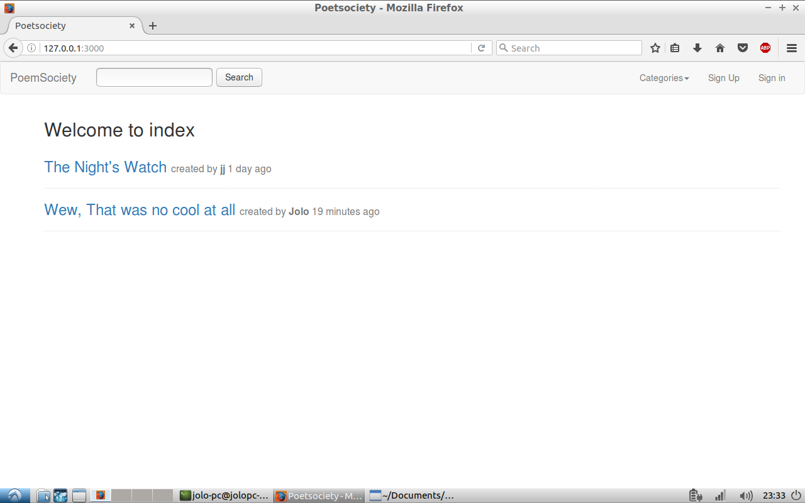
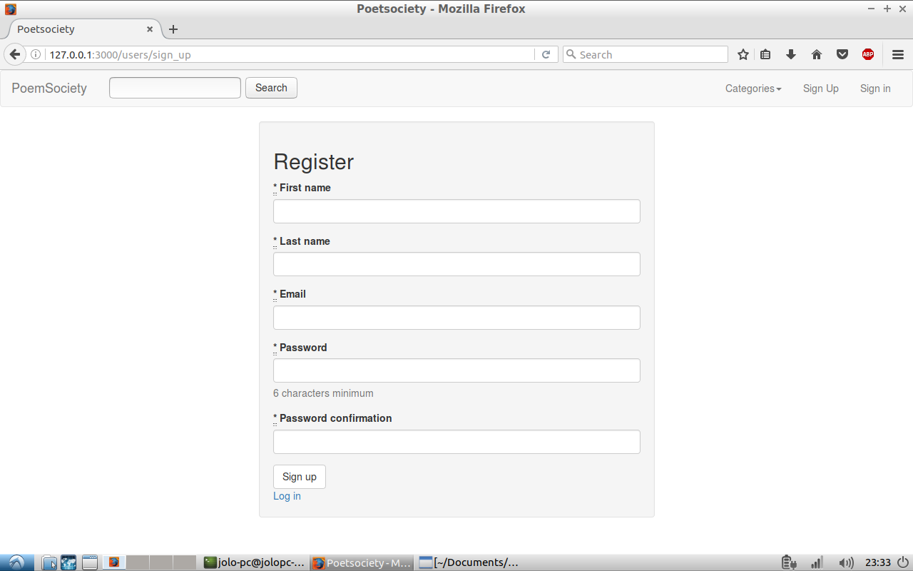
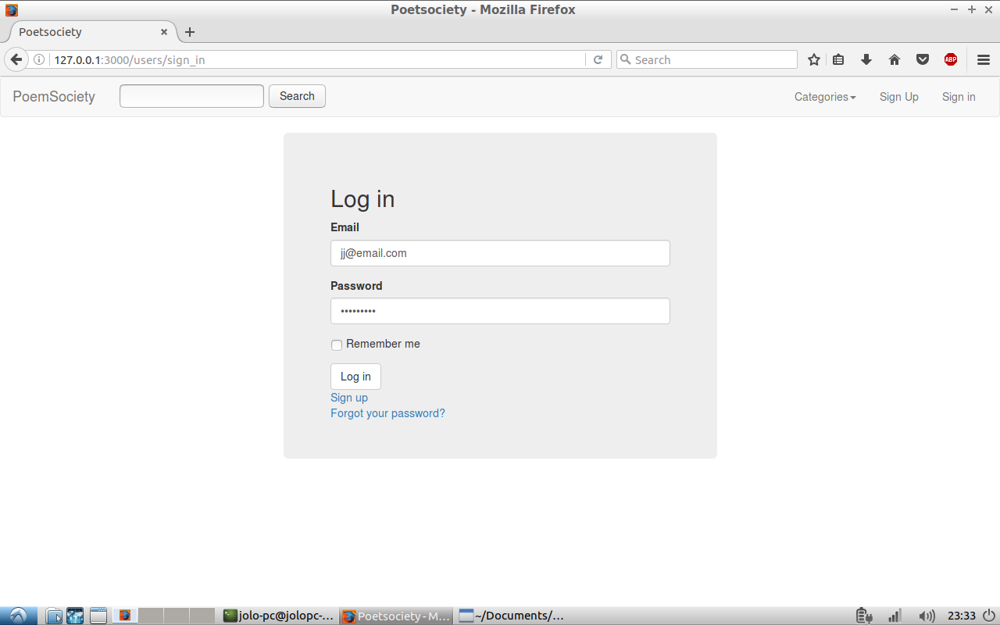
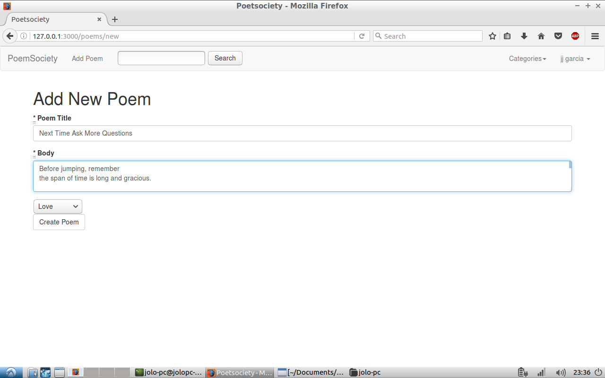
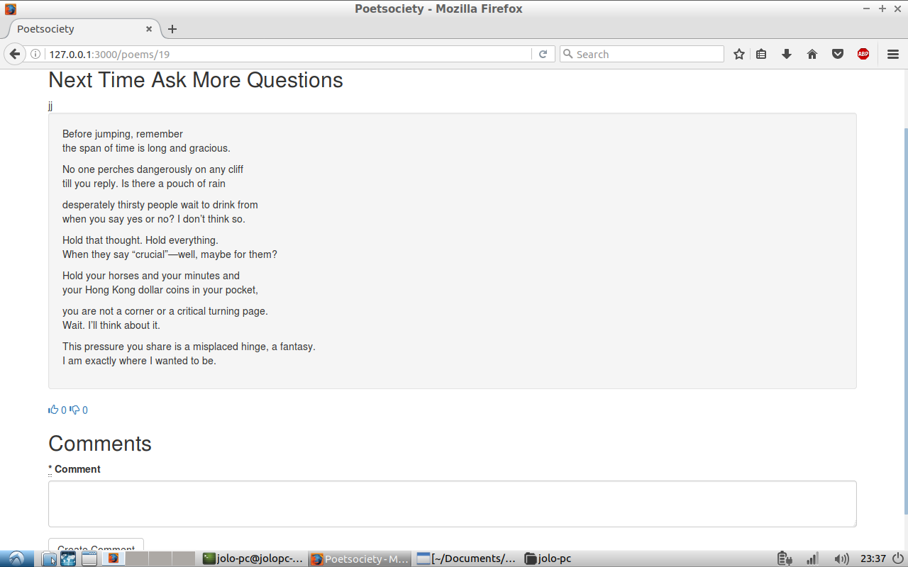

# README

The index page of the program

in order for the user to upload a poem, they must register and log in to the system first.

Signed in users can add poems

Poems can be views and users can add a comment at the same time
